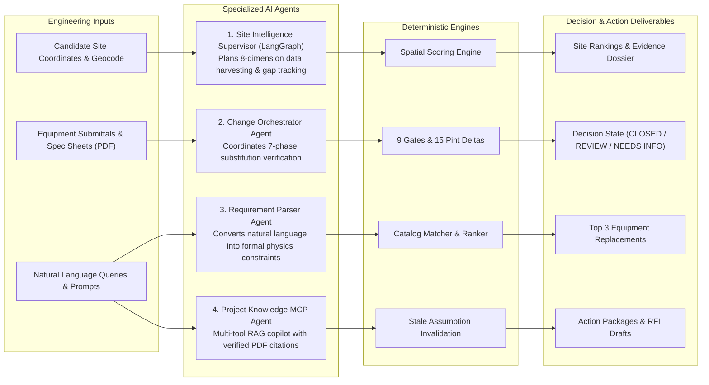
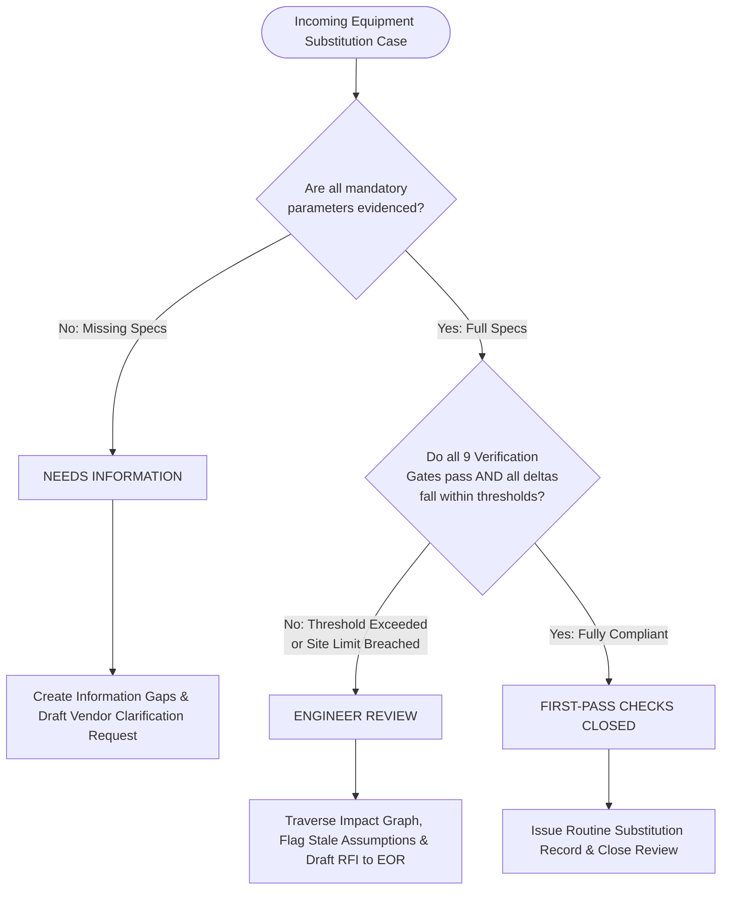

<div align="center">

# The Wet Stack: Mireye

---

### *Mission-Critical Data Center Site Feasibility and Deterministic Change Intelligence Pipeline*

<br/>


<br/>

[Quick Overview](#quick-overview) • [Problem & Solution](#problem--solution) • [Tech Stack & Libraries](#tech-stack--libraries) • [Agent Architecture](#agent-architecture) • [Key Features](#key-features) • [Physical-World Datasets](#physical-world-datasets--lifecycle-actions) • [Decision Logic](#decision-precedence) • [Quick Start](#quick-start) • [REST API & Docs](#documentation)

</div>

---

## Quick Overview

**The Wet Stack** is an enterprise EPC intelligence platform powered by **Mireye Physical-World Intelligence APIs**. It bridges high-resolution geospatial, environmental, and infrastructure data directly into mission-critical data center feasibility and on-site construction change verification.

---

## Problem & Solution

### The Industry Problem
* **Before Construction (Site Selection):** Developers spend months evaluating parcels using fragmented, unverified spreadsheets across power, water, climate, and soil, leading to expensive post-acquisition surprises and delayed energization.
* **During Construction (Equipment Substitutions):** When supply chain delays force equipment substitutions (e.g. chillers, transformers), contractors approve replacements based on superficial nameplate capacity without evaluating electrical MCA/MOCP headroom, structural slab loads, site ASHRAE extreme climate limits, or multi-equipment cascade loading.

### Solution: Powered by Mireye Physical-World Intelligence

Our solution leverages **Mireye's physical-world intelligence layer** as the ground-truth data engine. By uniting Mireye's multi-source environmental data with deterministic Python engineering engines, the platform guarantees that every feasibility ranking and field equipment change is evaluated against verified physical-world constraints:

#### 1. Before Construction: Site Feasibility Intelligence (via Mireye Data Layer)
* **Mireye Multi-Layer Geospatial Ingestion:** Ingests 30 physical-world parameters across terrain, water chemistry, utility grid reliability, flood zones, and extreme climate conditions directly through Mireye connectors (USGS 3DEP, FEMA NFHL, EIA-861, EPA WQP, NOAA/ASHRAE, NRCS, and FCC).
* **Transparent Multi-Factor Scoring:** Scores parcels across 8 critical dimensions (Terrain, Water, Power, Fiber, Geotechnical, Natural Hazards, Climate, and Permitting) using an explainable mathematical formula rather than ungrounded AI predictions.
* **Evidence Provenance & Gap Tracking:** Every metric retains its citation and relation type (Exact, Unit-Converted, Categorical-Normalized, Contextual Proxy). Missing or unevidenced attributes are explicitly tracked as blocking or non-blocking *Information Gaps* instead of being assumed or hallucinated.

#### 2. During Construction: Change Intelligence & Boundary Verification
* **Mireye Site Boundary Verification:** Directly links site-specific environmental baselines retrieved from Mireye (such as peak summer dry-bulb/wet-bulb temperatures and grid reliability) into the equipment verification pipeline.
* **Submittal PDF & Spec Sheet Ingestion:** PyMuPDF OCR extracts structured mechanical, electrical, and dimensional parameters directly from manufacturer submittals.
* **9 Deterministic Verification Gates:** Evaluates strict pre-comparison boundary criteria (Manufacturer Comparability, Voltage/Phase Matching, Refrigerant Compliance, Rated Ambient vs Site ASHRAE Climate Extremes, Physical Footprint Boundary, and Structural Floor Loading).
* **15 Pint Unit-Checked Deltas:** Computes unit-safe physical and electrical deltas (weight, maximum support point load, length, width, height, footprint area, voltage, phases, FLA, MCA, MOCP, power input, refrigerant type, refrigerant charge, cooling capacity) with dimensional safety thresholds.
* **Facility Design Margins & Headroom:** Tracks remaining substation transformer headroom, central chilled water duty, and structural slab capacities. Missing baseline capacities are explicitly flagged as `NEEDS_INFORMATION`.
* **Cumulative Cascade Loading Analysis:** Evaluates the combined, facility-wide impact of multiple concurrent equipment substitutions across electrical infrastructure, standby generators, and structural steel.
* **11-Category Recommendation Studio:** Uses NLP constraint extraction to query benchmark equipment catalogs and rank alternatives using deterministic multi-criteria scoring.
* **Automated Action Packages & RFIs:** Generates formal engineering drafts (RFIs to Engineers of Record, vendor clarification requests, engineering review packages) complete with calculated delta tables and source citations.
* **Project Knowledge MCP Agent:** Interactive engineering copilot equipped with hybrid vector RAG and automatic detection of stale project assumptions invalidated by field modifications.

---

## Tech Stack & Libraries

### Backend Stack
* **`fastapi` (`>=0.110`)**: Asynchronous API framework and typed OpenAPI contract generator.
* **`uvicorn[standard]` (`>=0.29`)**: High-throughput ASGI production server.
* **`pydantic` (`>=2.6`) & `pydantic-settings`**: Runtime schema validation and environment management across 47 domain models.
* **`pint` (`>=0.23`)**: Deterministic physical and electrical unit arithmetic and dimensional verification.
* **`pymupdf` / fitz (`>=1.24`)**: PDF specification sheet ingestion, OCR, and table/text extraction.
* **`langgraph` (`>=0.2`)**: Stateful graph orchestration for multi-step agent investigations.
* **`httpx` (`>=0.27`)**: Asynchronous HTTP client for external geospatial and environmental APIs.
* **`redis` (`>=5.0`)**: In-memory caching for external datasets and distributed rate-limiting.
* **`pytest` (`>=8.1`) & `ruff` (`>=0.4`)**: Automated test runner and high-speed Python static analysis.

### Frontend Stack
* **`react` & `react-dom` (`^18.3.1`)**: Component-driven UI architecture for engineering telemetry.
* **`typescript` (`^5.6.3`)**: Strict static type checking matching backend Pydantic schemas.
* **`vite` (`^6.0.5`)**: Development server with instant HMR and optimized production rollup builds.
* **`tailwindcss` (`^4.0.0`)**: Curated engineering design system and responsive layout styling.
* **`lucide-react` (`^0.469.0`)**: High-clarity technical iconography.
* **`recharts` (`^2.15.0`)**: Reactive visual charts for electrical deltas, design margins, and site rankings.
* **`leaflet` & `react-leaflet` (`^1.9.4` / `^4.2.1`)**: Geospatial site parcel mapping and boundary visualization.

---

## Agent Architecture

The platform deploys four specialized AI agents designed to plan, retrieve, and synthesize engineering context without performing unverified calculations:



### Agent Roles & Specifications

1. **Site Intelligence Supervisor (`apps/api/app/agent/workflow.py` & `planner.py`)**
   * **Role:** LangGraph-based supervisor that progressively investigates candidate parcels.
   * **Workflow:** Assesses coordinates, calls external dataset adapters (USGS elevation, FEMA flood maps, EIA electrical grids, EPA water quality, ASHRAE climate stations), flags missing parameters as unassumed *Information Gaps*, and feeds validated evidence to the scoring engine.

2. **Change Orchestrator Agent (`apps/api/app/agent/change_orchestrator.py`)**
   * **Role:** Coordinates the 7-phase verification lifecycle of proposed equipment substitutions.
   * **Workflow:** Extracts submittal parameters, triggers verification gates, runs Pint unit delta checks, evaluates facility margins, and determines the formal engineering decision state.

3. **Requirement Parser Agent (`apps/api/app/agent/change_orchestrator.py`)**
   * **Role:** Natural language translator for engineering queries.
   * **Workflow:** Parses inputs such as *"Need a 1500 kW water-cooled chiller with COP > 6.0 and footprint under 25 m2"* into typed mathematical constraints (`cooling_capacity >= 1500 kW`, `cop > 6.0`, `footprint <= 25 m2`) for catalog ranking.

4. **Project Knowledge & Document Agent (`apps/api/app/agent/knowledge_agent.py`)**
   * **Role:** Model Context Protocol (MCP) copilot for active construction review.
   * **Workflow:** Queries hybrid vector/BM25 embeddings of ingested submittals, inspects live project assumptions, performs live web queries for manufacturer datasheets, and flags stale assumptions when newly uploaded documents contradict earlier baselines.

---

## Key Features

### 1. Change Intelligence (During Construction)
* **9 Deterministic Verification Gates:** Boundary checks verifying Manufacturer Comparability, Voltage/Phase Match, Refrigerant Environmental Suitability, Rated Ambient vs Site ASHRAE Climate Extremes, Physical Footprint Boundary, and Structural Floor Loading.
* **15 Pint Unit-Checked Deltas:** Mathematical differences for weight, maximum support point load, length, width, height, footprint area, voltage, phases, full load amps, MCA, MOCP, power input, refrigerant type, refrigerant charge and cooling capacity. COP is not among them: it is a ratio the catalog publishes, not a delta the engine computes.
* **Facility Design Margins:** Computes remaining electrical substation capacity, central plant chilled water duty, and structural slab capacity. Missing baselines are flagged explicitly as `NEEDS_INFORMATION`.
* **Cost, Energy & Schedule Impact:** Calculates annual OPEX deltas (energy and water utility costs) and flags critical-path lead-time schedule delay risks.
* **Equipment Recommendation Studio:** Multi-category catalog covering 11 equipment types with deterministic multi-criteria scoring out of 100.
* **Cumulative Cascade Loading Analysis:** Assesses facility-wide cumulative impacts of simultaneous changes against substation transformer, backup generator, and structural steel limits.
* **Action Package & RFI Generator:** Generates structured drafts for RFIs to Engineers of Record (EOR), vendor clarification requests, and engineering change sign-off packages.

### 2. Site Intelligence (Before Construction)
Evaluates candidate parcels across an 8-dimension deterministic matrix:
1. **Terrain & Topography:** Slope variance, digital elevation models (DEM), earthwork cut-and-fill.
2. **Water Availability & Quality:** Municipal water capacity, groundwater total dissolved solids (TDS), and pH.
3. **Power Infrastructure:** Transmission line proximity, grid capacity, utility SAIDI/SAIFI reliability history.
4. **Fiber Connectivity:** Distance to long-haul fiber routes, carrier point-of-presence (PoP) density.
5. **Civil & Geotechnical:** Soil bearing capacity, seismic peak ground acceleration (PGA), liquefaction risks.
6. **Natural Hazards:** FEMA 100-year and 500-year flood plain boundaries, wildfire risk indices.
7. **Environmental & Climate:** ASHRAE 0.4% and 1.0% dry-bulb / coincident wet-bulb design conditions (StationFinder).
8. **Zoning & Regulatory:** Heavy industrial zoning compatibility, local environmental permitting timelines.

---

## Physical-World Datasets & Lifecycle Actions

The platform uses **Mireye's Physical-World Intelligence Layer** as its primary spatial evidence backbone, complemented by verified public datasets with strict provenance rules: every value serves its actual measurement with licensing and download dates, or stays an unassumed *Information Gap*.

### Physical-World Intelligence & Dataset Sources

| Source & Dataset | Module Provider | Serves Field(s) | Records / Coverage | Licence |
| :--- | :--- | :--- | :--- | :--- |
| **Mireye Physical-World API** | `LiveMireyeClient` / `MockMireyeClient` | 30 spatial, environmental, civil, and grid reliability fields | Live multi-source connectors (USGS, FEMA, EIA, EPA, NOAA, NREL, NRCS, FCC) | Commercial / Mireye API |
| **PeeringDB `/api/fac`** | `PeeringDBFacilities` | `distance_to_ix_km`, `ix_facility_carrier_count` | 1,353 US carrier hotel / IX facilities | CC-BY 4.0 |
| **EPA / USGS Water Quality** | `WaterQualityPortal` | `water_quality_tds_mg_l` | Real lab TDS samples within 40 km radius | Public Domain |
| **EIA Form EIA-861 (2023)** | `EIAReliability` | `grid_reliability_saidi_min` | 734 utilities across 2,840 US counties | Public Domain |
| **USGS PAD-US 4.1** | `PADUSProtectedAreas` | `protected_area_distance_km` | 298,244 protected public land tracts | Public Domain |
| **FEMA National Risk Index** | `FEMANationalRiskIndex` | `wildfire_risk_index` | 84,093 US census tracts | Public Domain |
| **ASHRAE / StationFinder** | `ClimateStation` | Summer DB/WB & Winter extreme temperatures | Global WMO weather monitoring stations | WMO / ASHRAE |
| **RacksDB & LBNL Catalog** | `equipment_reference_catalog` | Benchmark equipment physical & electrical ratings | 11 equipment categories | Open Benchmark |

### Dataset Management & CLI Actions

The backend provides explicit dataset lifecycle and caching actions via `app.datasets_cli`:

```bash
# 1. Inspect dataset status, availability, and served engineering fields
python -m app.datasets_cli list

# 2. Download or refresh national dataset tables into local DATA_DIR
python -m app.datasets_cli download peeringdb
python -m app.datasets_cli download all

# 3. Pre-warm per-coordinate queries (e.g. Water Quality Portal) for all project sites
python -m app.datasets_cli warm

# 4. In-App Open Catalog Auto-Fill:
# In the Web UI (Verification Tab), click "Auto-fill Missing Data from RacksDB"
# to deterministically populate missing submittal fields from verified benchmarks.
```

---

## Decision Precedence

Every equipment substitution resolves deterministically through a strict decision ladder:



---

## Quick Start

### Prerequisites
* Python 3.10+
* Node.js 20+

### Single-Command Start
```bash
python scripts/dev.py
```
This sets up the virtual environment, installs dependencies, seeds synthetic demo data, and runs the API and UI concurrently.

* **Web UI:** `http://localhost:5173`
* **FastAPI Backend:** `http://127.0.0.1:8000`
* **Interactive OpenAPI Docs:** `http://127.0.0.1:8000/docs`

### CLI Utility Commands
```bash
python scripts/dev.py --reset    # Wipe SQLite/vector cache and re-seed synthetic data
python scripts/dev.py --check    # Run full verification suite (pytest, ruff, tsc, vite build)
python scripts/dev.py --api-only # Run FastAPI backend only
python scripts/dev.py --ui-only  # Run Vite frontend only
```

### Running Tests
```bash
# Backend unit & integration tests
cd apps/api
pytest ../../tests -v
ruff check app ../../tests

# Frontend type safety & build check
cd apps/web
npm run lint
npm run build
```

---

## Documentation

Detailed architectural and engineering documentation is available in the [`docs/`](docs/) directory:

* [`docs/architecture.md`](docs/architecture.md): Component interaction models and state charts.
* [`docs/domain-model.md`](docs/domain-model.md): Schema definitions and evidence lifecycle rules.
* [`docs/engineering-rules.md`](docs/engineering-rules.md): Verification gates, delta thresholds, and safety limits.
* [`docs/scoring.md`](docs/scoring.md): Multi-factor parcel scoring mathematical formulas and weights.
* [`docs/api.md`](docs/api.md): REST API endpoints and payload specifications.
* [`docs/production-lld.md`](docs/production-lld.md): Production architecture design for PostgreSQL, Redis, Kafka, and Neo4j.
* [`docs/live-vs-demo.md`](docs/live-vs-demo.md): Service adapter configuration for mock versus live cloud infrastructure.
* [`docs/mireye-contract.md`](docs/mireye-contract.md): The Mireye request/response contract as verified against the live service, and the five mismatches that were corrected.
* [`docs/datasets.md`](docs/datasets.md): Every public dataset in use, and step-by-step procedures for the data that still has to be sourced by hand.
* [`docs/deployment.md`](docs/deployment.md): Render and Vercel deployment, OCR requirements, and what an ephemeral filesystem means for the demo.
* [`docs/verification-report.md`](docs/verification-report.md): Requirement coverage, commands run, and defects found and fixed.
* [`docs/demo-walkthrough.md`](docs/demo-walkthrough.md): A scripted run through both workflows.
* [`docs/limitations.md`](docs/limitations.md): Assumptions, safety limits, and what would need hardening before production use.
* [`docs/research-basis.md`](docs/research-basis.md): Sources behind the engineering rules, with citations checked.
* [`docs/submission-technical-brief.md`](docs/submission-technical-brief.md): Two-page technical brief, also rendered as a PDF.
* [`docs/demo-video-script.md`](docs/demo-video-script.md): Timed two-minute script for the demo video.
* [`docs/The-Wet-Stack-Mireye-Technical-Document.docx`](docs/The-Wet-Stack-Mireye-Technical-Document.docx): Two-page technical document for submission, with [corrections](docs/technical-doc-corrections.md) listing what was re-verified.
