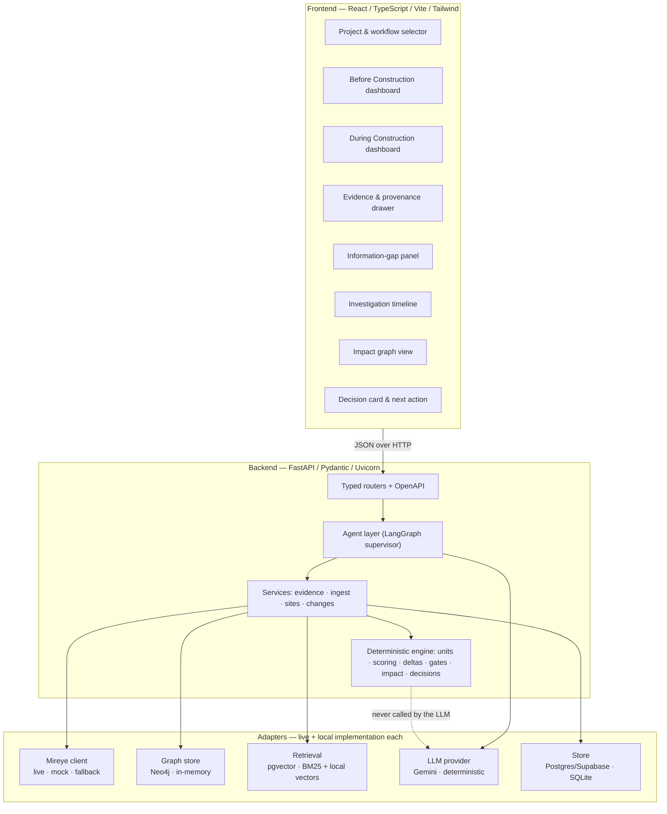
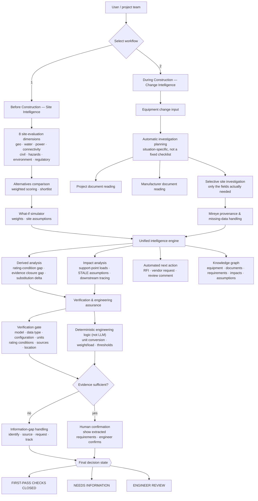
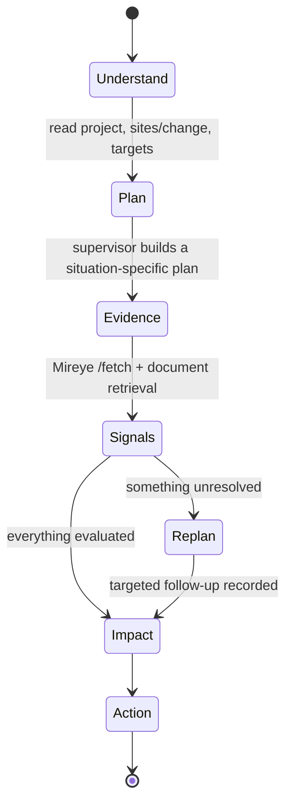
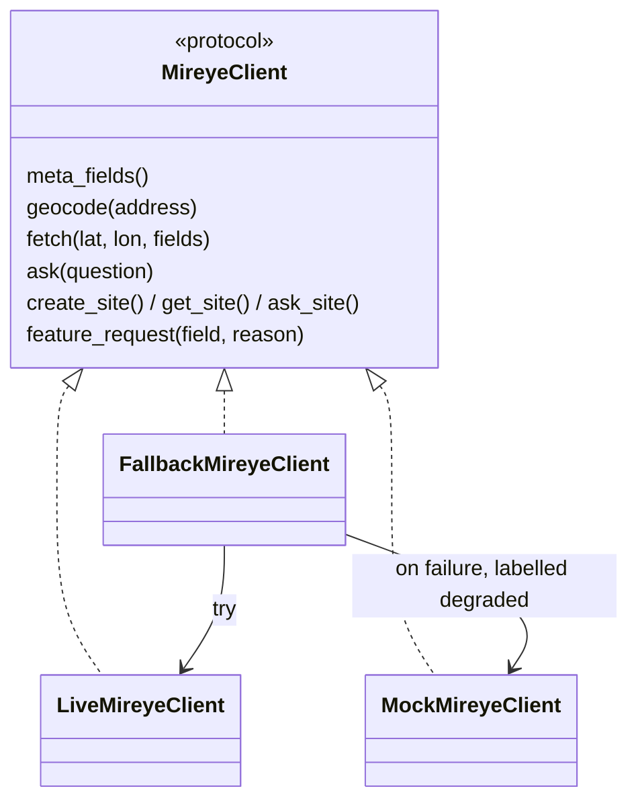
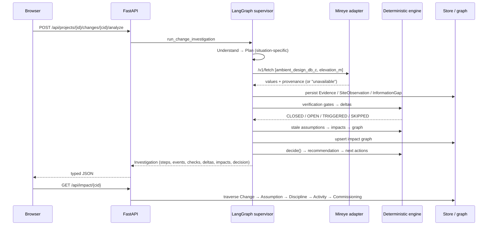

# Architecture

The architecture follows the one principle stated in the source document:

> **The agent decides what needs to be investigated; deterministic software performs the
> important calculations and verification.**

Everything the LLM may do is confined to *planning* and *explaining*. Every number that a
decision depends on is produced by tested Python in `apps/api/app/engine/`.

## System overview

## Architecture flow (source document, page 4)

## Agent workflow

`apps/api/app/agent/workflow.py` compiles a LangGraph `StateGraph` per workflow. The nodes are the
seven phases; `Replan` is entered conditionally and loops at most once, which is what makes the
investigation progressive rather than a fixed checklist.

What each phase does per workflow:

| Phase | Before Construction | During Construction |
| --- | --- | --- |
| Understand | Count candidates, read targets and weights | Read the change, both equipment records, the linked site |
| Plan | Broad sweep → shortlist → deep pass (+ a target-check step when the project sets one) | Steps derived from what actually differs: weight/support, refrigerant, electrical, site conditions (+ optional LLM-proposed steps, validated) |
| Evidence | `/v1/geocode` for address-only sites, then `/v1/fetch` of the 24 broad fields per site | Requirement retrieval, manufacturer retrieval, `/v1/fetch` of only the site fields needed |
| Signals | Score, rank, shortlist, evaluate hard targets | Run the 9 verification gates, then the 13 deltas |
| Replan | Deep pass on the shortlist only (10 further fields), then re-score | Add a targeted evidence step per OPEN gate — never assume the value |
| Impact | Consolidate gaps and unverifiable targets | Mark stale assumptions, derive impacts, build the graph |
| Action | Recommendation + clarification requests + confirmation | Decision state, recommendation, RFI / vendor request / review comment |

Every phase writes `InvestigationStep` and `ToolEvent` records, which is exactly what the UI
timeline renders — the observability is the data, not a separate log.

## Where the LLM is and is not

| Allowed | Not allowed |
| --- | --- |
| Propose extra investigation steps (validated against the field catalog; unknown fields dropped) | Compute or adjust any score, delta, threshold or unit conversion |
| Explain already-computed findings in prose, appended and labelled `(agent explanation)` | Decide the decision state |
| Answer exploratory questions via Mireye `/v1/ask` | Supply a value that fills an information gap |

With no `GEMINI_API_KEY` the `DeterministicNarrator` returns `None` and every caller falls back
to its template text. Decisions are byte-identical with and without an LLM.

## Adapter pattern

Each external service has one protocol and at least two implementations:

The same shape applies to `GraphStore` (Neo4j / in-memory), the retrieval `Index`
(pgvector / local vectors / BM25, fused) and `LLMProvider` (Gemini / deterministic).

## Storage

`Store` is a small document store over SQLite with a `records(collection, id, project_id,
parent_id, data)` table plus a TTL cache table. Domain objects are Pydantic models serialised to
JSON, so schema iteration costs nothing during a hackathon while the interface (`put`, `get`,
`list`, `delete`, `cache_get`, `cache_set`) is exactly what a Supabase/Postgres implementation
needs to satisfy.

Derived state — rankings, checks, deltas, impacts — is never stored independently. It lives on the
`Investigation` that produced it, so it can never drift from the evidence it was computed from.

## Request flow, end to end

