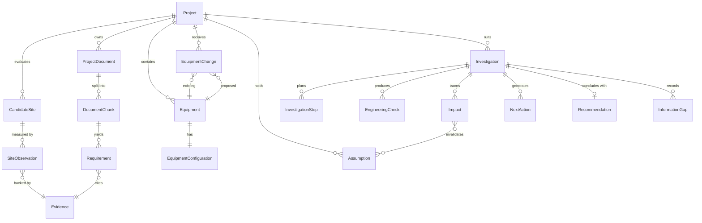
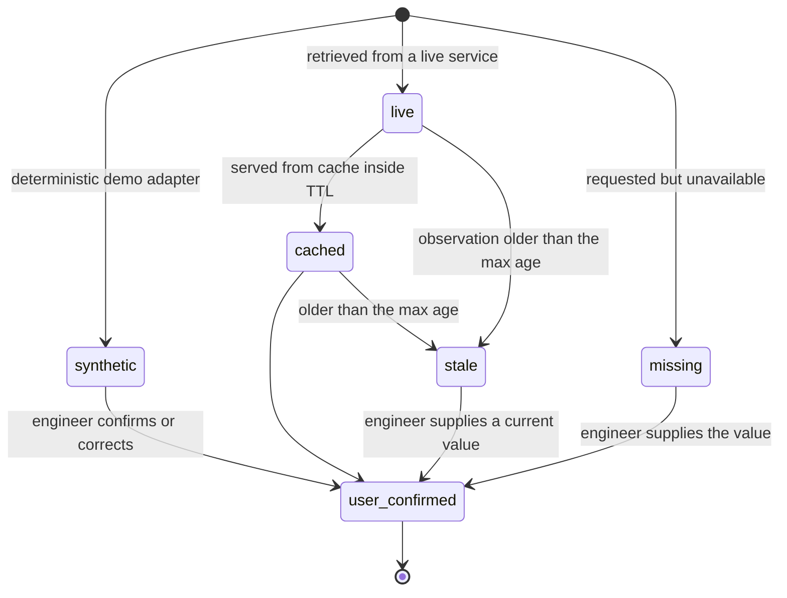

# Domain model

All schemas live in [`apps/api/app/domain.py`](../apps/api/app/domain.py) as Pydantic models and are
exposed through the generated OpenAPI document.

## Entity map

## Provenance: the core rule

Every accepted fact is an `Evidence` record. A missing fact is an `InformationGap` plus an
`Evidence` record with `status = missing` and `value = None`. **A missing value is never replaced
by a default, an average or a guess** — this is enforced in the engine (missing metrics are excluded
from a score and lower its coverage) and asserted by tests.

`EvidenceSource` carries: `source_type`, `source_id`, `source_name`, `page`, `section`, `span`,
`field_key`, `endpoint`, `request_fingerprint`, `url`, `synthetic`, `notes`.

`Evidence` adds: `status`, `verification`, `confidence`, `retrieved_at`, `observed_at`, `latitude`,
`longitude`, `location_resolution`, `superseded_by`, `stale_reason`.

### Evidence status lifecycle

Rules the code enforces:

* `missing` never ages into anything else — it stays missing until evidence arrives.
* `stale` keeps its value and its reason but is **not usable** for scoring; the dimension loses that
  metric and its coverage drops (`test_stale_evidence_reduces_confidence_but_keeps_score`).
* Overriding a value never deletes the previous one: the old record gets `superseded_by`.
* Status affects confidence through a documented multiplier: live/user-confirmed 1.0, cached 0.9,
  synthetic 0.6, stale 0.35, missing 0.0.

## Schemas

| Schema | Purpose | Notable fields |
| --- | --- | --- |
| `Project` | Container for both workflows | `targets` (hard pass/fail requirements), `dimension_weights` |
| `CandidateSite` | One site under consideration | `latitude`/`longitude` (validated), `geocode_resolution`, `shortlisted`, `mireye_site_id` |
| `SiteObservation` | One field value for one site | `field_key`, `dimension`, `value`, `unit`, `evidence_id`, `status` |
| `ProjectDocument` | An ingested PDF | `kind`, `sha256`, `page_count`, `extraction_status`, `extraction_error` |
| `DocumentChunk` | Retrievable text unit | `page`, `char_start`/`char_end`, `embedding` |
| `Requirement` | Candidate requirement extracted from a document | `field_key`, `value`, `unit`, `condition`, `equipment_tag`, `span`, `confirmed`, `corrected_from` |
| `Equipment` / `EquipmentConfiguration` | An item and its measurable configuration | `weight` + `weight_basis`, `support_points`, `rating_conditions`, `evidence_ids` (field → evidence) |
| `EquipmentChange` | Old → proposed substitution | `equipment_tag`, `site_id`, both equipment ids |
| `Evidence` / `EvidenceSource` | A fact and where it came from | see above |
| `Assumption` | A design assumption that can go stale | `depends_on_fields`, `status`, `stale_reason` |
| `Investigation` | One agent run, fully observable | `steps`, `events`, `replan_notes`, `checks`, `deltas`, `impacts`, `decision_state` |
| `InvestigationStep` | A planned unit of work | `phase`, `rationale`, `requested_fields`, `added_in_replan` |
| `EngineeringCheck` | A verification-gate or delta result | `status` (CLOSED/OPEN/TRIGGERED/SKIPPED), `expected`, `observed`, `gap_ids` |
| `DeltaResult` | One deterministic comparison | `absolute_delta`, `percent_delta`, `threshold_note`, `status` |
| `Impact` | Downstream consequence | `discipline`, `activities`, `commissioning`, `requires_human` |
| `ImpactGraph` / `ImpactNode` / `ImpactEdge` | The traversal result | `paths`, `backend` |
| `InformationGap` | Something that is not known | `why_it_matters`, `expected_source`, `suggested_action`, `blocking`, `feature_request_id` |
| `Recommendation` | The explained conclusion | `rationale`, `caveats`, `generated_by` |
| `NextAction` | The drafted request | `type`, `recipient`, `body`, `requested_items` |

## Enumerations

| Enum | Values |
| --- | --- |
| `EvidenceStatus` | `live` · `cached` · `synthetic` · `user_confirmed` · `missing` · `stale` |
| `SourceType` | `mireye` · `project_document` · `manufacturer_document` · `ahri_directory` · `external_dataset` · `user_input` · `derived` · `synthetic_fixture` |
| `VerificationStatus` | `unverified` · `verified` · `rejected` · `needs_review` |
| `CheckStatus` | `CLOSED` · `OPEN` · `TRIGGERED` · `SKIPPED` |
| `DecisionState` | `FIRST-PASS CHECKS CLOSED` · `NEEDS INFORMATION` · `ENGINEER REVIEW` |
| `Discipline` | `structural` · `electrical` · `mechanical` · `controls` · `installation_logistics` · `commissioning` |
| `InvestigationPhase` | `understand` · `plan` · `evidence` · `signals` · `replan` · `impact` · `action` · `done` |
| `SiteDimension` | `geo_terrain` · `water` · `power` · `connectivity` · `civil_soil` · `hazards_climate` · `environmental` · `regulatory` |
| `NextActionType` | `rfi` · `vendor_evidence_request` · `clarification_request` · `review_comment` · `human_confirmation` |
| `RiskLevel` | `low` · `moderate` · `elevated` · `high` |
| `AssumptionStatus` | `active` · `stale` · `retired` |

## Units

Quantities are never bare numbers: `Quantity{value, unit}` travels together and every comparison
goes through Pint (`app/engine/units.py`). Incompatible units raise `IncompatibleUnitsError` and
surface as a TRIGGERED check; unparseable units raise `UnknownUnitError` and surface as OPEN
(missing information). Neither is ever coerced.
