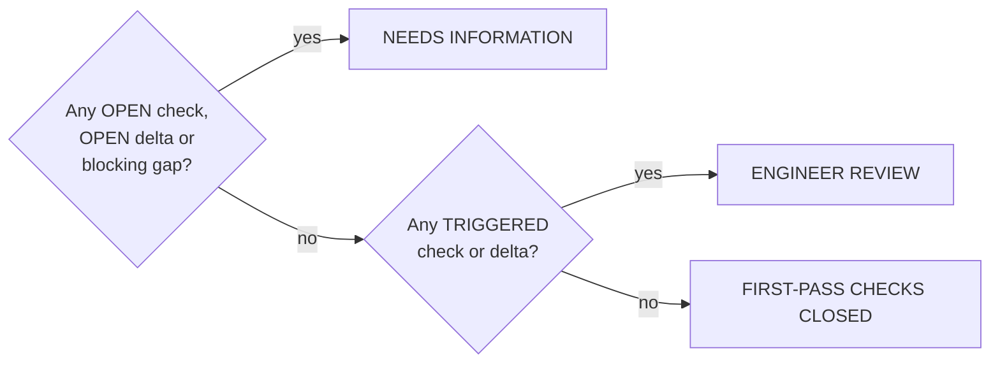

# Engineering rules

Everything here is deterministic Python with unit tests. The language model cannot reach any of it.

> **Limitation.** These are first-pass coordination checks. The platform flags that structural,
> electrical or mechanical coordination is *required*. It never asserts structural adequacy and is
> not professional engineering approval.

## Check statuses

| Status | Meaning | Effect on the decision |
| --- | --- | --- |
| `CLOSED` | Evaluated and satisfied | none |
| `OPEN` | **Cannot** be evaluated — evidence is missing | forces `NEEDS INFORMATION`, creates an `InformationGap` |
| `TRIGGERED` | Evaluated and not satisfied | forces `ENGINEER REVIEW`, drives impact tracing |
| `SKIPPED` | Not applicable to this case | none |

## Verification gates (`app/engine/gates.py`)

Run *before* any comparison is accepted.

| Gate | CLOSED when | OPEN when | TRIGGERED when |
| --- | --- | --- | --- |
| **Model identity** | Both sides state manufacturer + model and they differ | Either is missing | Both sides are the same model (nothing to substitute, or wrong submittal) |
| **Same data type** | Both weights are on the same basis | Basis undeclared on either side | Operating vs dry vs shipping weight compared |
| **Configuration comparability** | Same equipment type, circuit count, configuration code | Equipment type undeclared | Any of them differs |
| **Unit compatibility** | Every paired value converts cleanly | — | Dimensional conflict (e.g. kg vs kW) — severity `critical` |
| **Rating / operating conditions** | Both capacities rated at the same point (temps within 0.15 K, flows within 1 %) | Capacity stated without rating conditions | Rating-condition gap — the capacities are not the same quantity |
| **Source availability** | Every compared value cites a document | Any populated value has no evidence id | — |
| **Site compatibility** | Rated ambient ≥ site design dry-bulb | Rated ambient or site evidence missing/stale | Site is hotter than the rating — re-rating required |
| **Coordinate accuracy** | Geocode resolves to rooftop/parcel/building | No coordinates | Only street/city precision |
| **Capacity vs requirement** | Proposed capacity ≥ specified capacity | No requirement extracted, or no proposed capacity | Below the specified capacity — severity `critical` |

Site gates are `SKIPPED` when no site is linked to the change. When **Model identity** or **Unit
compatibility** is TRIGGERED, every otherwise-closed delta is downgraded to `SKIPPED`: an invalid
comparison must not produce a confident-looking number.

## Delta thresholds (`app/engine/deltas.py`)

Both values are converted to a canonical unit, then `Δ = new − old` and `Δ% = Δ/|old| × 100`.

| Field | TRIGGERED above | CRITICAL above | Canonical unit |
| --- | --- | --- | --- |
| Weight | 5 % | 15 % | kilogram |
| Max support-point load | 5 % | 15 % | kilonewton |
| Length / width / height | 2 % | 10 % | millimetre |
| Footprint area | 3 % | 12 % | m² |
| MCA / MOCP / FLA | 0 % (any change) | 10 % | ampere |
| Power input | 5 % | 15 % | kilowatt |
| Refrigerant charge | 10 % | 30 % | kilogram |
| Cooling capacity | 2 % | 10 % | kilowatt |
| Voltage / phases / refrigerant type | any change TRIGGERS | — | categorical |

Edge cases, all tested:

* **One side missing** → `OPEN` + an `InformationGap` naming the field. No substitute value.
* **Both sides missing** → `SKIPPED` ("not part of this change"), no gap.
* **Incompatible units** → `TRIGGERED`, no delta computed.
* **Unparseable unit** → `OPEN` (it is a missing-information problem, not a comparison failure).
* **Zero baseline** → percent change is `None`, reported as undefined rather than infinite.

Structural coordination is flagged only when weight or support-point load **increases** past its
threshold — and the wording is always "coordination required", never "adequate".

## Impact rules (`app/engine/impact.py`)

An assumption goes `STALE` when any field in its `depends_on_fields` actually changed. Impacts are
then derived from the triggered keys:

| Rule | Triggered by | Discipline | Human confirmation |
| --- | --- | --- | --- |
| Structural coordination | weight, support-point load | structural | yes |
| Electrical distribution review | MCA, MOCP, FLA, power input, voltage, phases | electrical | no |
| Cooling performance re-evaluation | cooling capacity, rating conditions, capacity requirement, site compatibility | mechanical | yes |
| Refrigerant handling & safety | refrigerant type, refrigerant charge | mechanical | no |
| Installation & rigging | length, width, height, footprint | installation & logistics | no |
| Controls & BMS integration | model identity, configuration, MCA, capacity, refrigerant type | controls | no |

Each impact carries concrete activities and a commissioning verification, which is what the graph
materialises as `Change → Stale assumption → Discipline → Activity → Commissioning` with relations
`INVALIDATES`, `AFFECTS`, `REQUIRES`, `VERIFIED_BY`.

## Decision precedence (`app/engine/decisions.py`)

Missing evidence outranks a threshold breach: you cannot ask an engineer to judge a comparison that
is not yet valid. Every recommendation carries the safety caveat, and `FIRST-PASS CHECKS CLOSED`
still generates a human sign-off action.

Decision confidence = `(evaluated checks + deltas) / total × (1 − 0.35 × synthetic evidence share)`,
so a demo-data decision never looks as certain as a fully sourced one.

## Next actions

| Situation | Action | Recipient |
| --- | --- | --- |
| Gap expecting manufacturer data | Vendor evidence request | Vendor / manufacturer rep |
| Gap expecting project documents | RFI | Design team / EOR |
| Gap expecting Mireye or survey data | Clarification request | Project controls / survey |
| TRIGGERED results, evidence complete | Review comment + engineer confirmation | Submittal reviewer, EOR |
| All closed | Engineer sign-off | EOR |

Each action body enumerates the exact missing items and asks for the rating conditions each value
is stated at.
