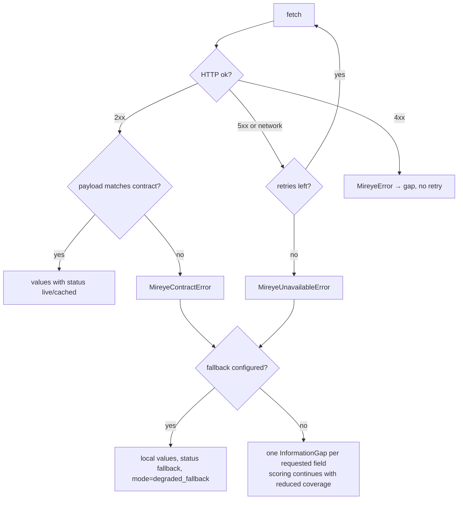

# Mireye integration contract

> **This contract is observed, not assumed.** Every shape below was captured from the live service
> at `https://api.mireye.com` and is recorded in [`tests/fixtures/mireye/`](../tests/fixtures/mireye/).
> [`tests/test_mireye_contract.py`](../tests/test_mireye_contract.py) pins each one offline, so the
> adapter cannot drift back to guesswork without a test failing.
>
> An earlier revision of this document described an *assumed* contract. It was wrong on five
> separate points; §"What the assumed contract got wrong" records them, because they are the reason
> the adapter is shaped the way it is.

**Base URL:** `https://api.mireye.com` · **Auth:** `Authorization: Bearer <MIREYE_API_KEY>`
(`GET /v1/meta/fields` needs no auth).

## Endpoints

| Endpoint | Used for | Where | Verified |
| --- | --- | --- | --- |
| `GET /v1/meta/fields` | Catalog of 306 provider fields, cached. The only source of legal provider names. | `meta_fields()`, `catalog_names()` | yes |
| `POST /v1/geocode` | Address → coordinates + accuracy | Site creation, Evidence phase | yes |
| `POST /v1/fetch` | **Primary endpoint.** Only the fields the agent actually needs | Scoring, site-compatibility checks | yes |
| `POST /v1/ask` | Exploratory natural-language questions | "Ask Mireye" panel | yes |
| `POST /v1/ask/stream` | Streaming variant | `ask_stream()` | no — shape assumed |
| `POST /v1/feature-requests` | Record an unavailable field instead of inventing a value | `record_fetch()` | no — shape assumed |
| `POST /v1/sites`, `GET /v1/sites/{id}`, `POST /v1/ask-site` | Registered candidate sites | `create_site()` etc. | no — unused, unverified |

`/fetch` is used for anything repeatable — scoring, ranking, engineering checks. `/ask` is used only
for exploration, its answers are labelled as such, and they never enter a calculation.

## Observed payloads

```jsonc
// GET /v1/meta/fields  — entries are identified by `name`. There is no `key`.
{ "billing": { "fetch_credits_per_field": 1,
               "metered_groups": { "parcel_record": { "credits_per_location_by_plan": { "build": 300, … },
                                                      "fields": ["parcel_zoning", …] } } },
  "fields": [ { "name": "elevation", "unit": "meters", "type": "float", "layer": "terrain",
                "nullable": false, "null_meaning": null, "source": "USGS_3DEP",
                "source_url": "…", "presets": ["terrain", …], "ttl_seconds": 31536000,
                "description": "…", "interpretation_hints": "…" } ],
  "presets": { "data_center_siting": [ … ], … }, "us_envelope": …, "version": … }

// POST /v1/geocode
{ "address": "1400 Grant Rd, East Wenatchee, WA" }
{ "lat": 47.405845, "lng": -120.265701, "accuracy": 1.0,
  "accuracy_type": "range_interpolation", "match_type": null,
  "normalized_address": "1400 Grant Rd, East Wenatchee, WA 98802",
  "provider": "geocodio", "source": "TIGER/Line® from the US Census Bureau" }

// POST /v1/fetch — coordinates OR address, never both (sending both returns 422)
{ "lat": 47.4235, "lng": -120.3103, "fields": ["elevation", "slope_degrees", "fema_flood_zone"] }
{ "address": "1400 Grant Rd, East Wenatchee, WA", "fields": ["fema_flood_zone"] }

{ "lat": 47.4235, "lng": -120.3103, "fetched_at": "2026-08-17T19:13:50.141882+00:00",
  "fields": {
    "elevation":       { "value": 203.6425018310547, "unit": "meters", "source": "USGS_3DEP_COG",
                         "source_url": "…", "confidence": "medium",
                         "fetched_at": "…", "dataset_vintage": "3DEP 1/3 arc-second seamless DEM",
                         "ttl_seconds": 31536000, "notes": null, "status": "ok" },
    "fema_flood_zone": { "value": null, … }        // a real absence, not an error
  } }

// POST /v1/ask — no citations array
{ "question": "What is the terrain like here?", "lat": 47.4235, "lng": -120.3103 }
{ "lat": …, "lng": …, "question": "…", "answered_at": "…", "answer": "…" }
```

## What the assumed contract got wrong

Each of these produced a hard failure the first time the adapter was pointed at the live service.

| # | Assumed | Observed | Symptom |
| --- | --- | --- | --- |
| 1 | catalog entries have `key` | they have `name` | `KeyError: 'key'` on every fetch |
| 2 | our 34 internal names are provider names | 306 provider names, only 2 coincide | every field rejected |
| 3 | geocode returns `latitude`/`longitude`/`resolution`/`formatted_address` | `lat`/`lng`/`accuracy_type`/`normalized_address` | `KeyError: 'latitude'` |
| 4 | fetch body takes `latitude`/`longitude` | `lat`/`lng`, or `address`, never both | HTTP 422 |
| 5 | response has `results{}` + `unavailable[]`, numeric `confidence` | `fields{}`, absence is `value: null`, `confidence` is a word | `ValueError: could not convert 'medium'` |

`KeyError` was not caught by `FallbackMireyeClient`, so failures 1, 3 and 5 killed the whole
investigation rather than degrading. That is why `MireyeContractError` now exists.

## Two vocabularies, translated at the boundary

The scoring engine speaks internal concept names; Mireye speaks its own. They never mix:
`fields.PROVIDER_MAP` translates on the way out, `PROVIDER_TO_INTERNAL` on the way back.

| Internal concept | Provider field | Conversion |
| --- | --- | --- |
| `elevation_m` | `elevation` | identity (m) |
| `mean_slope_pct` | `slope_degrees` | `tan(radians(x)) · 100` |
| `flood_zone` | `fema_flood_zone` | categorical |
| `distance_to_substation_km` | `nearest_substation_distance_m` | ÷1000 |
| `distance_to_highway_km` | `nearest_major_road_distance_m` | ÷1000 |
| `depth_to_bedrock_m` | `bedrock_depth_cm` | ÷100 |
| `seismic_pga_g` | `seismic_pga_2pct_50yr_g` | identity |
| `design_wind_speed_mph` | `design_wind_speed_mph` | identity |
| `extreme_heat_days_per_year` | `days_above_32c_annual_count` | identity |
| `soil_drainage_class` | `soil_drainage_class` | categorical, `"Well drained"` → `well_drained` |
| `ambient_design_db_c` | `design_wet_bulb_temperature_0_4pct_degc` | identity — **proxy, see below** |
| `fiber_routes_count` | `fiber_provider_count` | identity — **proxy** |
| `planned_grid_expansion_mw` | `interconnection_queue_active_capacity_county_mw` | identity — **proxy** |
| `wetland_fraction` | `wetland_fraction_of_parcel` | identity — **billed extra** |
| `zoning_class` | `parcel_zoning` | identity — **billed extra** |

The original provider field, value, unit and confidence word are written onto every `Evidence`
record, so a converted number can always be audited back to the reading it came from.

### Evidence relations — what a reading is allowed to do

Every mapping declares how the provider reading relates to the concept it is filed under. The
relation, not the status, decides whether a value may be used.

| Relation | Meaning | May populate a value, close its gap, pass a gate, count as coverage |
| --- | --- | --- |
| `EXACT` | the provider measures precisely this quantity | **yes** |
| `UNIT_CONVERTED` | same quantity, deterministic unit change | **yes** |
| `CATEGORICAL_NORMALIZED` | same quantity, vocabulary mapped | **yes** |
| `CONTEXTUAL_PROXY` | a *different* measurement that merely informs the concept | **no** |

A contextual proxy is retrieved, stored as `Evidence`, displayed and citable — but **no
`SiteObservation` is written for it**. Observations are what scoring, coverage and the verification
gates read, so withholding one is the mechanism: the concept stays missing, keeps its information
gap, and cannot be scored. Coverage is therefore computed from canonical evidence only.

Measured at Cascade Flats against the recorded fixture: treating the three proxies as measurements
gave coverage 0.348 with 22 missing fields; treating them as contextual gives **coverage 0.259 with
25 missing fields**. The decision state is unchanged (`NEEDS INFORMATION`).

### Proxies — mapped, but not the same quantity

A proxy is labelled on the evidence and in the UI. It is never presented as an exact match.

* **`ambient_design_db_c` ← `design_wet_bulb_temperature_0_4pct_degc`.** The provider supplies the
  0.4% design **wet-bulb**; the concept is the design **dry-bulb**. Wet-bulb is the lower of the
  two, so the CH-01 site-compatibility gate (rated ambient ≥ site design dry-bulb) is
  **optimistic** on this input. Confirm the dry-bulb from project climate data before relying on
  that check in live mode.
* **`fiber_routes_count` ← `fiber_provider_count`.** Counts providers in the hex, not physically
  diverse long-haul routes; two providers may share one conduit.
* **`planned_grid_expansion_mw` ← `interconnection_queue_active_capacity_county_mw`.** Generation
  seeking connection, not utility-committed additions.

### Billed separately

`wetland_fraction_of_parcel` and `parcel_zoning` belong to Mireye's `parcel_record` group, billed at
**300 credits per location** against 1 credit for an ordinary field. They are mapped but excluded
from every request unless `MIREYE_INCLUDE_PARCEL_FIELDS=true`. Left off, they behave as unavailable
and become information gaps.

### Concepts with no provider equivalent

19 of the 34 have nothing in the 306-field catalog that measures the same thing. They are declared
`unavailable`, become `Evidence{status: missing}` + an `InformationGap` + one deduplicated
`/v1/feature-requests` submission, and are excluded from the score — never defaulted to zero.

`grid_capacity_mw` · `grid_reliability_saidi_min` · `latency_to_ix_ms` · `distance_to_fiber_km` ·
`permit_lead_time_months` · `incentive_score` · `jurisdiction_complexity_index` ·
`water_stress_index` · `water_quality_tds_mg_l` · `groundwater_availability_l_s` ·
`distance_to_water_source_km` · `terrain_ruggedness_index` · `land_cover_class` ·
`cut_fill_volume_m3` · `soil_bearing_capacity_kpa` · `wildfire_risk_index` ·
`protected_area_distance_km` · `cropland_fraction` · `biodiversity_sensitivity_index`

Each carries a specific reason (in `fields.NO_PROVIDER_EQUIVALENT`) rather than a generic
"unavailable" — e.g. the catalog *does* expose interconnection-queue capacity, but that is
generation seeking connection, not deliverable load capacity, so it is not a substitute for
`grid_capacity_mw`.

## Rules the adapter enforces

| Rule | Implementation |
| --- | --- |
| Never guess a provider field name | `_partition()` maps internal → provider names; the result is checked against the live catalog, and a name the catalog lacks raises `MireyeContractError` |
| Never invent a value | `value: null`, an omitted field, an unmapped concept and a billed-extra concept all become `Evidence{status: missing}` + `InformationGap` |
| Never send a contradictory request | coordinates and `address` are mutually exclusive in `fetch()` / `fetch_by_address()` |
| Convert deterministically | named entries in `fields.CONVERSIONS`, unit-tested at boundary and null values |
| Keep the raw reading | `provider_field`, `provider_value`, `provider_unit`, `provider_confidence`, `provider_source_url` on every `FieldValue` and in the evidence notes |
| Degrade, don't die | response-validation, missing-key, type and confidence failures raise `MireyeContractError` ⊂ `MireyeError`, which `FallbackMireyeClient` catches |
| Don't hide bugs | only Mireye/transport errors are caught; an unrelated exception still propagates |
| Don't spam the provider | feature requests are deduplicated per field in the local cache for 30 days |
| Distinguish stand-ins from data | fallback values are `status = fallback` — never `live`, and distinct from demo-mode `synthetic` |

## Failure behaviour



Covered by `tests/test_mireye_contract.py` (27 tests) and `tests/test_evidence.py`
(`::test_fallback_client_degrades_and_records_the_reason`,
`::test_a_drifted_contract_degrades_rather_than_failing_the_investigation`,
`::test_feature_requests_are_submitted_once_per_field`).

## Cost guardrails

Mireye bills per field per location, so an unbounded sweep is an unbounded bill. These limits are
conservative by default and every one of them is enforced in code, not by convention.

| Control | Default | Effect |
| --- | --- | --- |
| `MIREYE_MAX_LIVE_LOCATIONS` | `3` | Locations one investigation may fetch live |
| `MIREYE_MAX_LIVE_FETCHES` | `8` | Live `/v1/fetch` calls per investigation, across all locations |
| `MIREYE_INCLUDE_PARCEL_FIELDS` | `false` | Keeps the 300-credit `parcel_record` group out of every request |
| `MIREYE_ENABLE_FEATURE_REQUESTS` | `false` | `/v1/feature-requests` is unverified, so gaps are recorded locally |
| `MIREYE_CACHE_TTL_SECONDS` | `900` | Repeat fetches for the same location + field set are served from cache |

**Reaching a limit is not an error.** The sites that were not queried record an `InformationGap`
saying so — *"… was not requested for X: the live location limit for this investigation (3) was
reached"* — rather than failing the run or quietly presenting partial coverage as complete.

The budget binds only when the client is live; mock mode is free and unlimited.

Further protections:

* **Every fetch logs its plan before spending** — location, field names, whether the billed group is
  included, and an estimated credit count. No key or header is ever logged.
* **`/v1/ask` is never called during scoring.** It is exploratory, separately billed, and reachable
  only from the explicit "Ask Mireye" endpoint. A regression test fails if the scoring path calls it.
* **The test suite cannot reach a provider.** An autouse fixture replaces the real httpx transport,
  so any test that opens a socket to `api.mireye.com` fails with an explicit message instead of
  spending credits. Tests supplying their own `MockTransport` are unaffected.
* **`scripts/smoke_test.py` refuses to sweep a live backend.** It reads `/api/meta` first and aborts
  before touching `/api/projects` unless `services.mireye == "mock"`, overridable only with
  `--i-understand-this-spends-credits`.
* **The opt-in live test uses one location**, three ordinary fields, and asserts that the parcel
  group is disabled before it runs.

## Live mode is opt-in

Mock mode needs no network and no credentials, and is unchanged by this integration. Live mode
turns on only when **both** `MIREYE_BASE_URL` and `MIREYE_API_KEY` are set.

```bash
MIREYE_BASE_URL=https://api.mireye.com
MIREYE_API_KEY=<token>
# MIREYE_INCLUDE_PARCEL_FIELDS=true   # opt into the 300-credit parcel_record group
```

An opt-in live test guards against provider drift and costs ~3 credits:

```bash
RUN_MIREYE_LIVE_TESTS=1 python -m pytest tests/test_mireye_live.py -q -s
```

## Demo adapter

`MockMireyeClient` is unchanged and still speaks **internal** field names, so demo mode is
completely independent of the provider vocabulary. The same coordinates always return the same
values; five curated profiles back the seeded demo and Prairie Junction deliberately omits fields so
the gap and feature-request paths run in every demo. Every mock value carries
`status = "synthetic"` and the note *"Deterministic demo value — not a real observation"*.

## Mireye MCP

The documented MCP tools (`mireye_ask`, `mireye_fetch`, `mireye_geocode`) map one-to-one onto
`MireyeClient.ask/fetch/geocode`. An MCP-backed implementation is one more class against the same
protocol; no caller changes.
