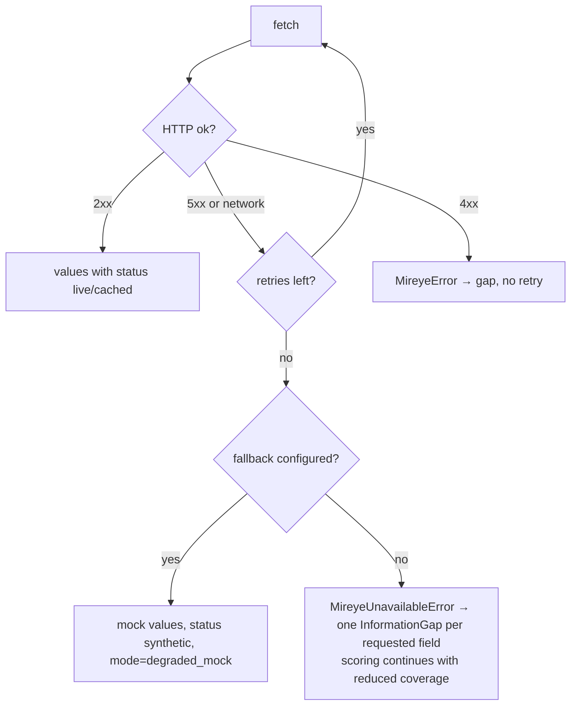

# Mireye integration contract

> **This document describes an *assumed* contract.** The published Mireye documentation lists the
> endpoints but not their payload shapes. Every assumption is isolated in one file —
> [`apps/api/app/adapters/mireye.py`](../apps/api/app/adapters/mireye.py) — so correcting it when
> the real specification arrives touches nothing else in the codebase.

## Endpoints used

| Endpoint | Used for | Where |
| --- | --- | --- |
| `GET /v1/meta/fields` | Field catalog, cached. The only source of legal field names. | `meta_fields()` |
| `POST /v1/geocode` | Address → coordinates + resolution | Site creation, `Evidence` phase |
| `POST /v1/fetch` | **Primary endpoint.** Only the fields the agent actually needs | Scoring, site compatibility checks |
| `POST /v1/ask` | Exploratory natural-language questions | "Ask Mireye" in the knowledge panel |
| `POST /v1/ask/stream` | Streaming variant for live agent output | `ask_stream()` |
| `POST /v1/sites` | Register a candidate site | `create_site()` |
| `GET /v1/sites/{site_id}` | Read a registered site | `get_site()` |
| `POST /v1/ask-site` | Question scoped to a registered site | `ask_site()` |
| `POST /v1/feature-requests` | Record an unavailable field instead of inventing a value | Every unavailable field in `record_fetch()` |

`/fetch` is used for anything repeatable — scoring, ranking, engineering checks. `/ask` is used only
for exploration and its answers are labelled as such; they never enter a calculation.

## Assumed payloads

```jsonc
// GET /v1/meta/fields
{ "fields": [ { "key": "elevation_m", "label": "Elevation", "unit": "m", "description": "…" } ] }

// POST /v1/geocode
{ "address": "1400 Grant Rd, East Wenatchee, WA" }
{ "latitude": 47.4235, "longitude": -120.3103, "resolution": "parcel",
  "formatted_address": "…", "confidence": 0.9 }

// POST /v1/fetch
{ "latitude": 47.4235, "longitude": -120.3103,
  "fields": ["elevation_m", "flood_zone"], "site_id": "optional" }
{ "results": {
    "elevation_m": { "value": 320, "unit": "m", "confidence": 0.9,
                     "observed_at": "2025-01-01T00:00:00+00:00", "source": "usgs-3dep" } },
  "unavailable": ["flood_zone"] }

// POST /v1/ask  ·  POST /v1/ask-site
{ "question": "…", "latitude": 47.4, "longitude": -120.3 }        // or { "site_id", "question" }
{ "answer": "…", "citations": [ … ], "confidence": 0.7 }

// POST /v1/sites
{ "name": "Cascade Flats", "latitude": 47.4235, "longitude": -120.3103, "address": "…" }
{ "site_id": "…" }

// POST /v1/feature-requests
{ "field": "grid_capacity_mw", "reason": "…", "context": "project=… site=…" }
{ "id": "fr_…", "status": "received" }
```

## Correcting the contract

1. Replace the request builders in `LiveMireyeClient` (`fetch`, `geocode`, `ask`, …).
2. Replace `LiveMireyeClient._to_observation` — the single mapping from a raw field payload to the
   internal `FieldValue` (value, unit, confidence, observed_at, source, status).
3. If field *names* differ, edit [`apps/api/app/fields.py`](../apps/api/app/fields.py); the catalog
   there doubles as the scoring specification, so the two can never drift apart.

Nothing else needs to change: services, the engine, the agent and the UI only see `FieldValue`,
`FetchResult`, `GeocodeResult` and `AskResult`.

## Rules the adapter enforces

| Rule | Implementation |
| --- | --- |
| Never guess a field name | `fetch()` validates every key against the cached catalog and raises `UnknownFieldError` |
| Never invent a value | Unavailable fields become `Evidence{status: missing}` + `InformationGap` + a `/v1/feature-requests` submission |
| Always record provenance | Source, endpoint, retrieval time, observation time, confidence, coordinates and location resolution are stored on every value |
| Bound the blast radius of an outage | 12 s timeout, 2 retries with exponential backoff (0.25 s → 0.5 s → 1 s), TTL cache, and mock fallback that marks itself `degraded_mock` |
| Cache the catalog | `mireye:meta:fields`, TTL `MIREYE_CACHE_TTL_SECONDS` (default 900 s) |
| Cache repeat fetches | Key `mireye:fetch:{lat}:{lon}:{sorted fields}`; a cache hit returns `status = cached`, not `live` |

## Failure behaviour



Tests covering this: `tests/test_evidence.py::test_live_client_retries_then_raises`,
`::test_live_client_caches_repeat_fetches`, `::test_fallback_client_degrades_to_mock_and_records_the_reason`,
`::test_service_records_gaps_when_mireye_is_down`, `::test_unknown_field_is_rejected_not_invented`.

## Demo adapter

`MockMireyeClient` is deterministic: the same coordinates always return the same values. Five
curated site profiles back the seeded demo; any other coordinate is generated from a SHA-256 of
`field|lat|lon` mapped into the field's plausible range. Two profiles deliberately omit fields
(`grid_capacity_mw`, `permit_lead_time_months`, `wetland_fraction` at Prairie Junction) so the
information-gap and feature-request paths are exercised in every demo run.

Every mock value is returned with `status = "synthetic"` and a note reading
*"Deterministic demo value — not a real observation"*, which the UI renders as an amber badge.

## Mireye MCP

The documented MCP tools (`mireye_ask`, `mireye_fetch`, `mireye_geocode`) map one-to-one onto
`MireyeClient.ask/fetch/geocode`. Adding an MCP-backed implementation means writing one more class
against the same protocol; no caller changes.
