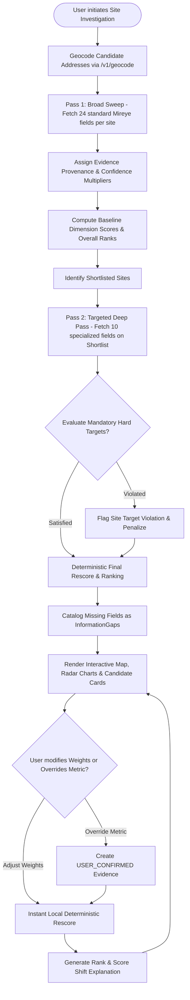
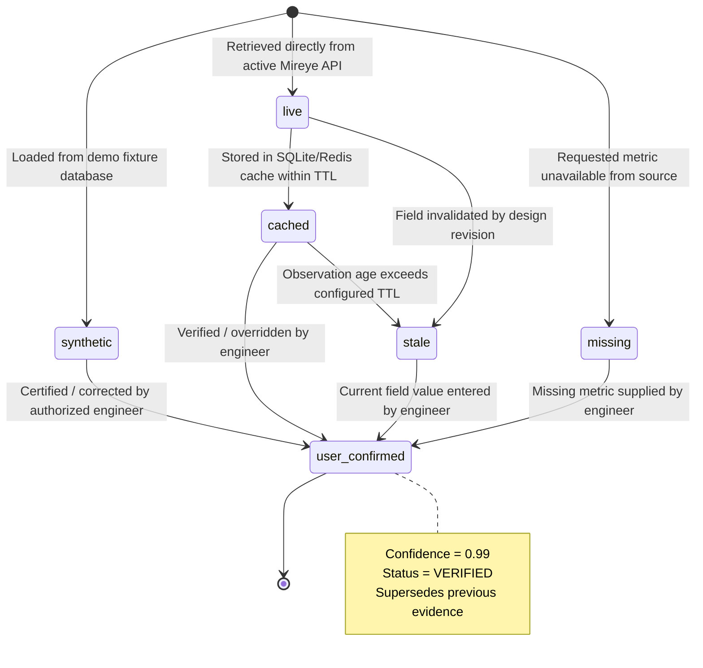
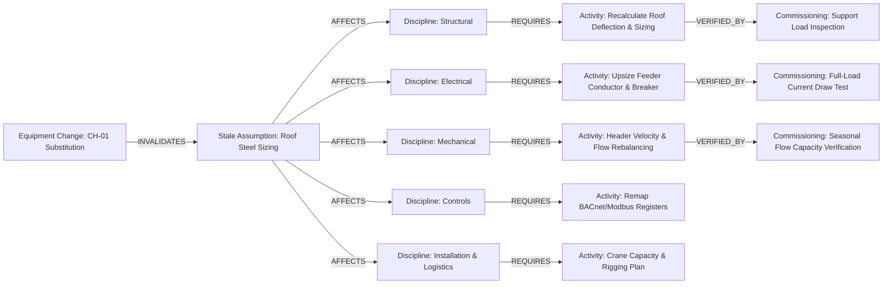
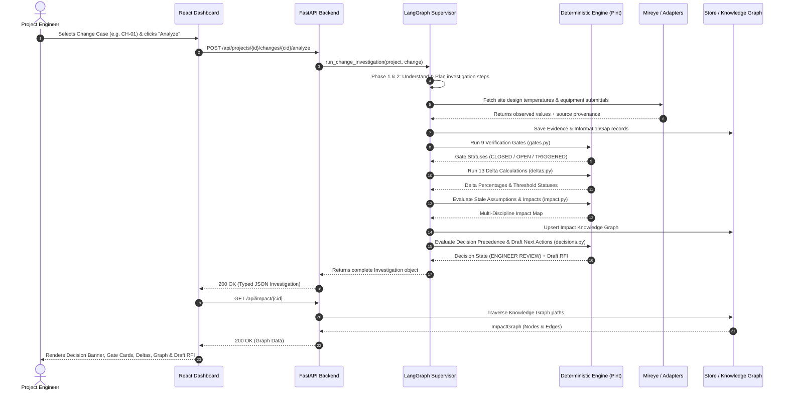

# Complete Architecture & Workflow Flow Diagrams

This document contains complete, detailed visual flowcharts and state diagrams representing the entire lifecycle of data, agent execution, deterministic calculations, and user interactions in **The Wet Stack — Mireye**.

---

## 1. System Architecture & Component Boundaries

```mermaid
flowchart TB
    subgraph Client["Frontend Client (React 18 / TypeScript / Vite / Tailwind)"]
        UI_MAIN["App Shell & Navigation"]
        UI_BC["Before Construction Dashboard (Map / Scores / What-If)"]
        UI_DC["During Construction Dashboard (Submittal Compare / Gates / Deltas)"]
        UI_KN["Project Knowledge & PDF Search"]
        UI_EV["Evidence & Provenance Slide-over"]
        UI_GAP["Information Gap Drawer"]
        UI_ACT["Next Action / Draft RFI Viewer"]
    end

    subgraph API["Backend API (FastAPI / Pydantic / Uvicorn)"]
        ROUTERS["Typed API Routers (/api/projects, /sites, /changes, /documents)"]
        SERVICES["Business Services (sites · changes · ingest · evidence)"]
        
        subgraph AgentLayer["Agent Orchestration (LangGraph)"]
            SUP["Supervisor Planner"]
            GRAPH["7-Phase StateGraph"]
            NARR["Deterministic / LLM Narrator"]
        end

        subgraph DeterministicEngine["Deterministic Engineering Engine (Python / Pint)"]
            UNITS["Unit Registry (Pint)"]
            GATES["9 Verification Gates"]
            DELTAS["13 Threshold Delta Computations"]
            SCORE["8-Dimension Scoring Engine"]
            IMPACT["Multi-Discipline Impact Derivation"]
            DECIDE["3-Tier Precedence Decision Engine"]
        end
    end

    subgraph Adapters["Dual-Mode Adapter Layer"]
        AD_MIR["Mireye Client (Live HTTPX / Mock Client)"]
        AD_GRP["Graph Store (Neo4j / In-Memory Store)"]
        AD_VEC["Retrieval Index (pgvector / BM25 + Local Vectors)"]
        AD_DB["Document Store (PostgreSQL / SQLite3)"]
    end

    Client <-->|REST over HTTP (JSON)| ROUTERS
    ROUTERS --> SERVICES
    SERVICES --> AgentLayer
    SERVICES --> DeterministicEngine
    AgentLayer --> DeterministicEngine
    SERVICES <--> Adapters
    AgentLayer <--> Adapters
```

---

## 2. Before Construction — Site Intelligence Flow



---

## 3. During Construction — Change Intelligence Decision Pipeline

```mermaid
flowchart TD
    INPUT[Input: Existing Equipment vs Proposed Substitution] --> AGENT_PLAN[Agent Plans Situation-Specific Investigation]
    AGENT_PLAN --> FETCH_DOCS[Retrieve Cited Project & Manufacturer Documents]
    AGENT_PLAN --> FETCH_SITE[Fetch Relevant Site Ambient Conditions]
    
    FETCH_DOCS & FETCH_SITE --> GATES[Run 9 Pre-Verification Gates]
    
    subgraph GateVerification["Verification Gates Check (gates.py)"]
        G1[1. Model Identity]
        G2[2. Weight Basis / Data Type]
        G3[3. Configuration Comparability]
        G4[4. Pint Unit Compatibility]
        G5[5. Rating Conditions Equivalency]
        G6[6. Document Source Provenance]
        G7[7. Site Ambient Temperature Compatibility]
        G8[8. Coordinate Resolution]
        G9[9. Capacity vs Spec Requirement]
    end
    
    GATES --> G1 & G2 & G3 & G4 & G5 & G6 & G7 & G8 & G9
    
    G1 & G2 & G3 & G4 & G5 & G6 & G7 & G8 & G9 --> GATE_EVAL{Any Gate Open or Triggered?}
    
    GATE_EVAL --> DELTAS[Run 13 Deterministic Delta Computations (deltas.py)]
    
    subgraph DeltaComputations["Delta Computations"]
        D_WT[Weight Δ% > 5%]
        D_SP[Support Point Load Δ% > 5%]
        D_DIM[Dimensions L/W/H Δ% > 2%]
        D_ELE[MCA / MOCP / FLA Any Increase > 0%]
        D_PWR[Power Input Δ% > 5%]
        D_REF[Refrigerant Charge Δ% > 10%]
        D_CAP[Cooling Capacity Δ% > 2%]
        D_CAT[Voltage / Phase / Refrigerant Type Mismatch]
    end
    
    DELTAS --> D_WT & D_SP & D_DIM & D_ELE & D_PWR & D_REF & D_CAP & D_CAT
    
    D_WT & D_SP & D_DIM & D_ELE & D_PWR & D_REF & D_CAP & D_CAT --> IMPACT[Trace Downstream Impacts & Mark Stale Assumptions]
    
    IMPACT --> PRECEDENCE{Decision Precedence Logic}
    
    PRECEDENCE -->|Any OPEN check / missing data / gap| DEC_NEEDS[Decision: NEEDS INFORMATION]
    PRECEDENCE -->|Any TRIGGERED gate or threshold breach| DEC_ENG[Decision: ENGINEER REVIEW]
    PRECEDENCE -->|All Gates CLOSED & All Deltas ≤ Threshold| DEC_PASS[Decision: FIRST-PASS CHECKS CLOSED]
    
    DEC_NEEDS --> ACT_VEND[Draft Vendor Evidence Request / Clarification RFI]
    DEC_ENG --> ACT_REV[Draft Structured Review Comments & Confirmation Package]
    DEC_PASS --> ACT_SIGN[Draft Engineer Sign-off Package]
```

---

## 4. LangGraph 7-Phase Agent Execution & Replanning Loop

```mermaid
stateDiagram-v2
    [*] --> Understand
    
    Understand --> Plan : Project scope, sites, and change items parsed
    note right of Understand: Reads target specifications, candidate sites or change cases
    
    Plan --> Evidence : Supervisor constructs situation-specific plan
    note right of Plan: Validates requested fields against catalog; drops unknown keys
    
    Evidence --> Signals : Execute parallel API fetches & doc retrievals
    note right of Evidence: Queries Mireye /v1/fetch and vector search index
    
    Signals --> Replan : Unresolved gates or missing fields detected (max 1 loop)
    Signals --> Impact : All required evidence evaluated
    note right of Signals: Evaluates 9 gates, 13 deltas, and scoring functions
    
    Replan --> Impact : Targeted follow-up evidence collected
    note right of Replan: Re-queries targeted endpoints for specific missing data
    
    Impact --> Action : Assumptions evaluated & impact graph generated
    note right of Impact: Marks stale assumptions and maps 6-discipline ripple effects
    
    Action --> Done : Decision state finalized & next action drafted
    note right of Action: Computes final confidence and generates actionable drafts
    
    Done --> [*]
```



---

## 5. 6-Stage Evidence Lifecycle State Machine



---

## 6. Multi-Discipline Downstream Impact Graph Traversal



---

## 7. Document Ingestion, Chunking & Hybrid Retrieval Pipeline

```mermaid
flowchart TD
    UPLOAD[PDF Document Uploaded] --> VALIDATE{Validate Filetype & Size ≤ 25MB}
    VALIDATE -->|Invalid| REJECT[Reject with 422 Error]
    VALIDATE -->|Valid| STORE_FILE[Save File to Secure Upload Directory]
    
    STORE_FILE --> MUPDF[PyMuPDF / fitz Page-Aware Parser]
    MUPDF --> CHUNK[Split into Text Chunks with Character Spans & Page Offsets]
    
    CHUNK --> REGEX[Regex & Entity Extraction Engine]
    REGEX --> EXTRACT_REQ[Extract Requirements, Equipment Tags & Model IDs]
    EXTRACT_REQ --> STORE_REQ[Persist Requirements & Document Records]
    
    CHUNK --> HYBRID[Index in Hybrid Retrieval Store]
    
    subgraph RetrievalEngine["Hybrid Search Engine (vectorstore.py)"]
        BM25[BM25 Lexical Keyword Indexer]
        VEC[Local Hashed N-Gram Embeddings / pgvector]
        FUSION[Reciprocal Rank Fusion / Scoring]
    end
    
    HYBRID --> BM25 & VEC --> FUSION
    
    STORE_REQ --> HUMAN_UI[Display in UI for Human Confirmation / Sign-off]
    FUSION --> SEARCH_API[Serve Citations via /api/projects/{id}/search]
```

---

## 8. Frontend-Backend Request & Response Sequence


